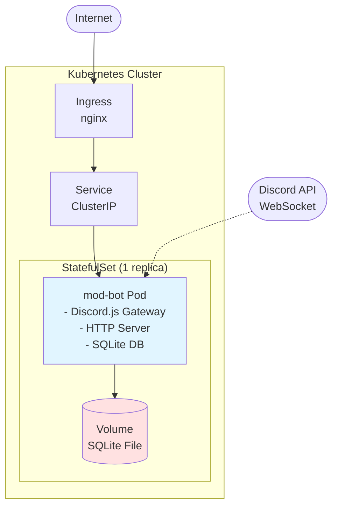
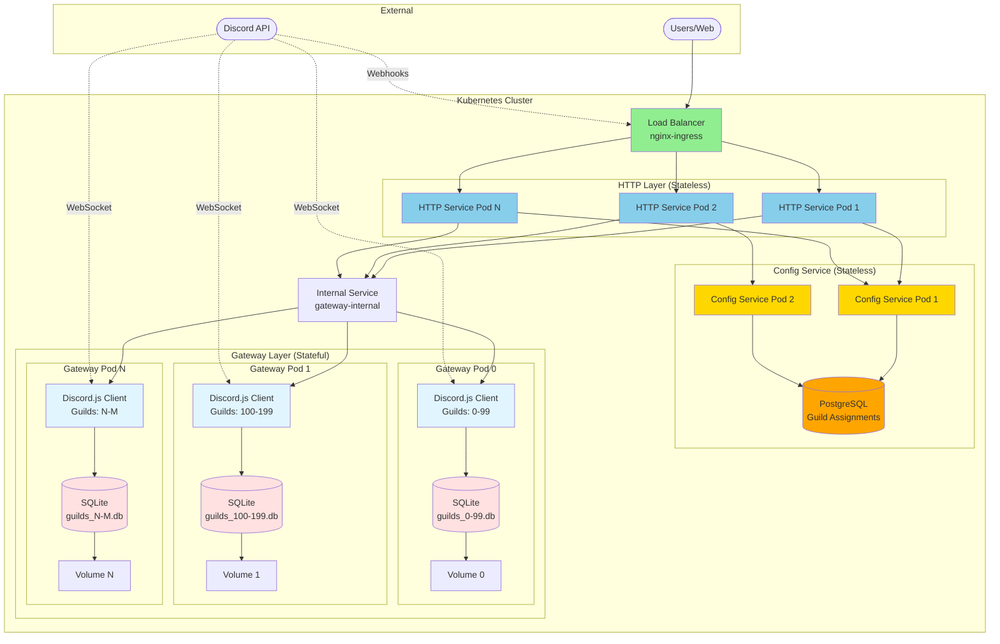
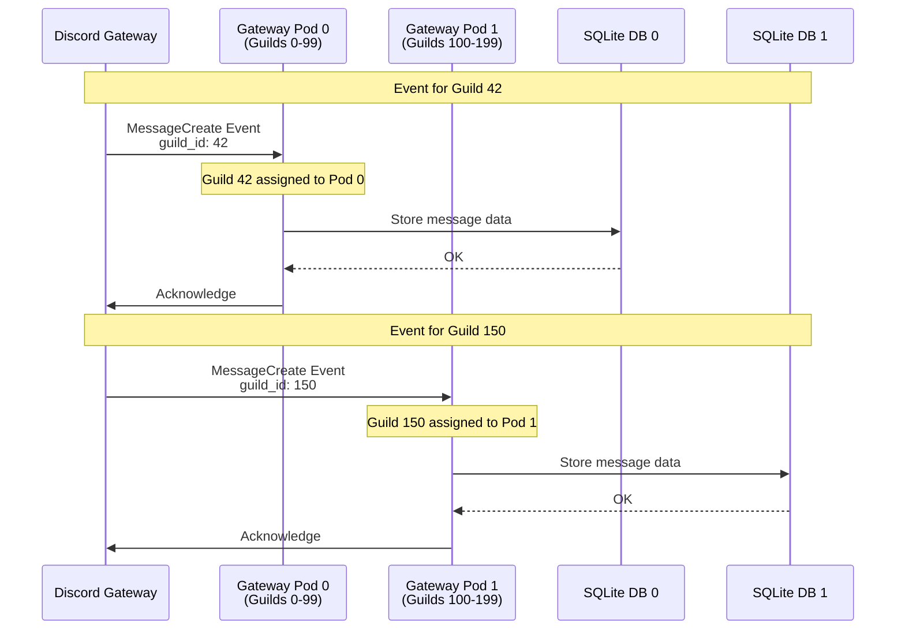
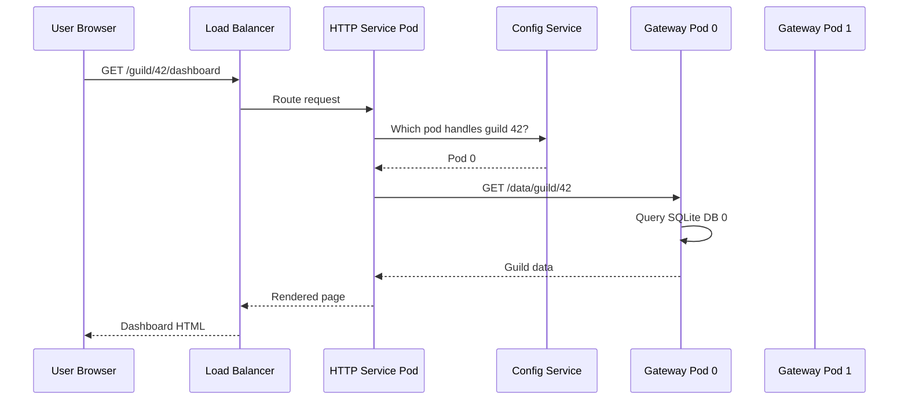
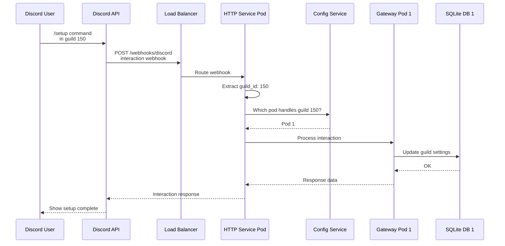
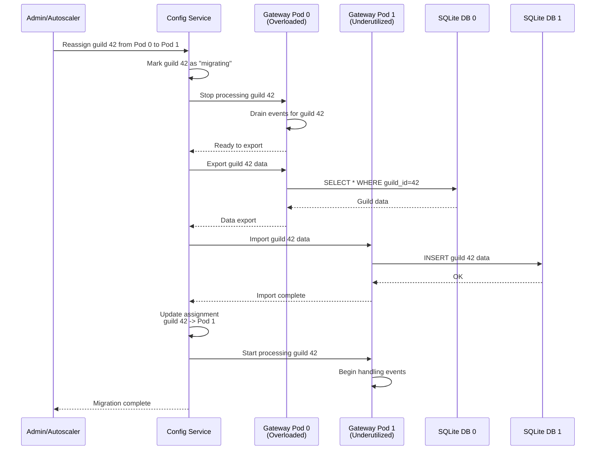
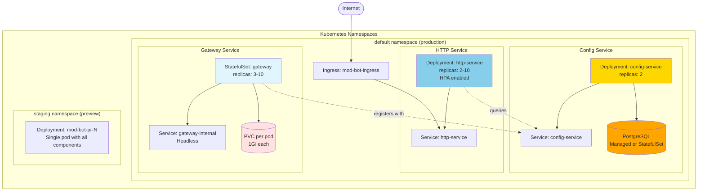
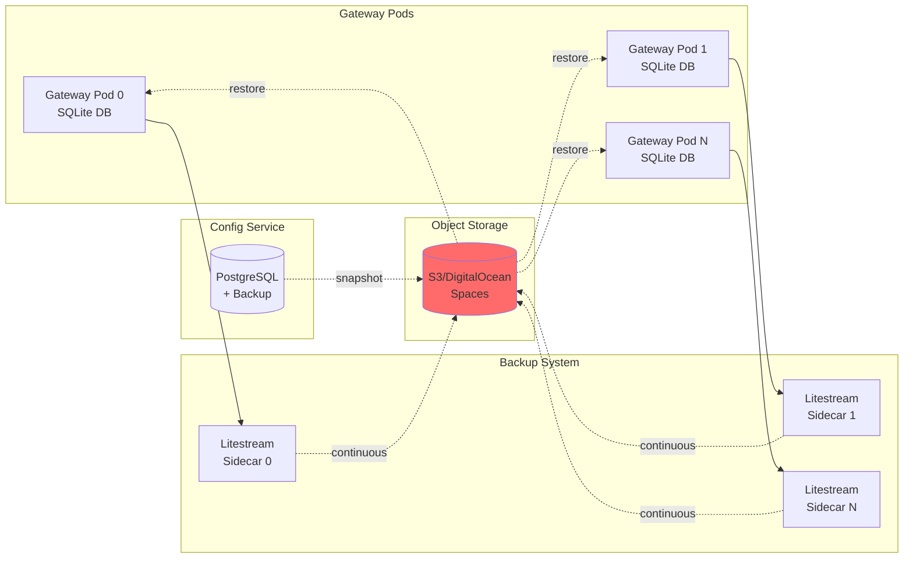
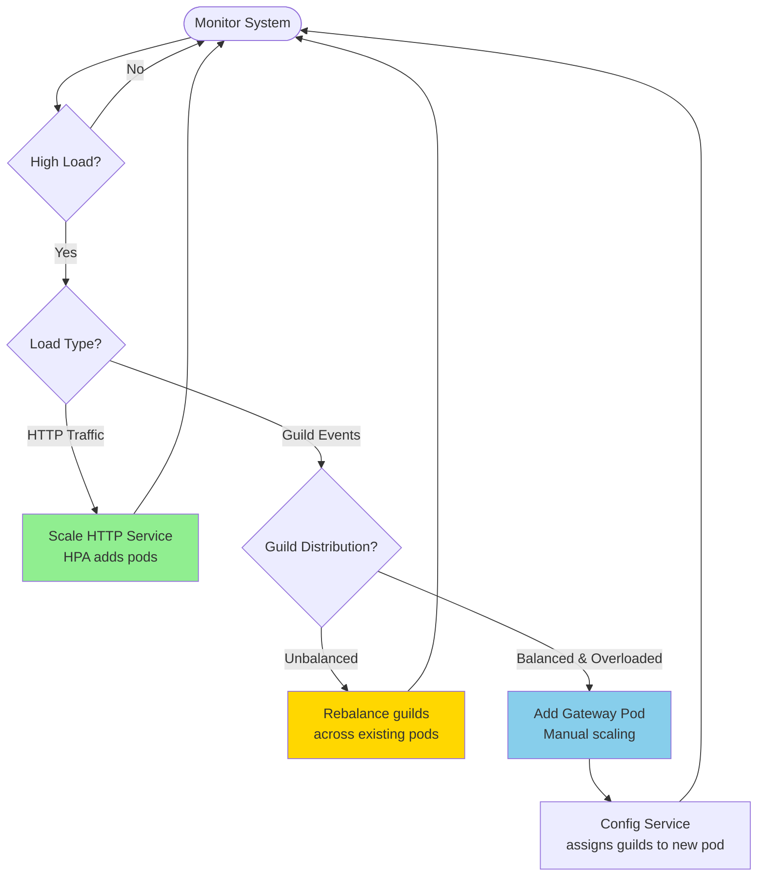
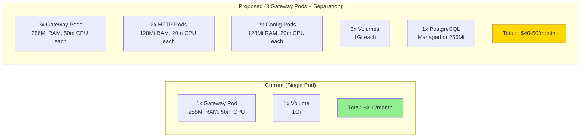

# Architecture Diagrams

## Current Architecture (Single Pod)

## Proposed Architecture: Guild-Based Pod Assignment

## Request Flow: Discord Event Processing

## Request Flow: HTTP Request Routing

## Request Flow: Discord Interaction (Command)

## Guild Reassignment Flow

## Deployment Architecture

## Data Flow: Backup and Recovery

## Scaling Decisions

## Cost Comparison

## Notes

- **HTTP Service**: Stateless, can use regular Deployment with HPA
- **Config Service**: Stateless (state in PostgreSQL), can use regular Deployment
- **Gateway Pods**: Stateful (SQLite local storage), must use StatefulSet
- **Volumes**: Each gateway pod needs its own persistent volume
- **PostgreSQL**: Can use managed service (DigitalOcean) or run StatefulSet
- **Internal Communication**: All service-to-service uses Kubernetes internal DNS
- **External Access**: Only HTTP service is exposed via Ingress
